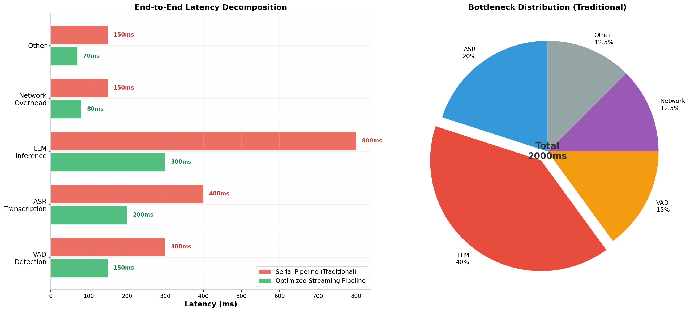
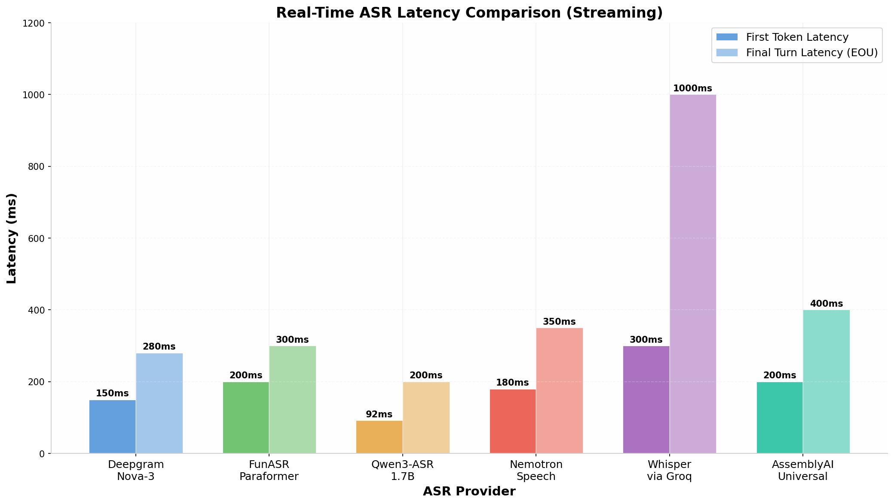
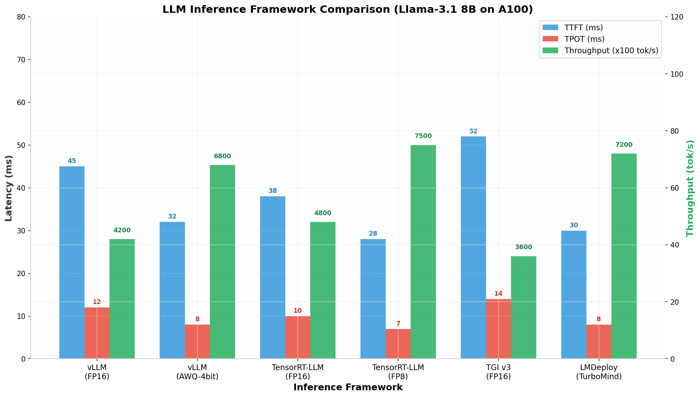
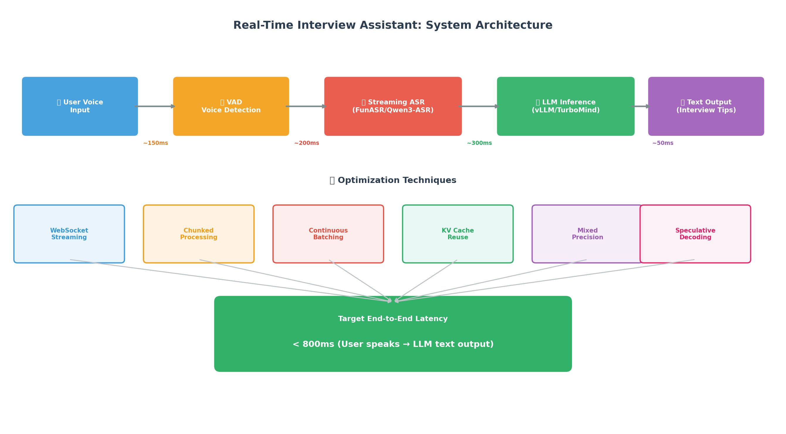

# 实时流式音频转写+大模型生成：低延迟技术全景分析

## 简要回答

针对**面试辅助**场景（云端部署，仅需"语音转文字→LLM生成文字回答"），实现低延迟的核心路径是：**选择原生流式ASR（如Qwen3-ASR 1.7B/FunASR或Deepgram Nova-3，首字延迟<200ms）+ 部署LLM推理引擎（vLLM/LMDeploy TurboMind，TTFT<50ms）+ WebSocket流式管道**，端到端延迟可控制在**600-900ms**。关键优化点包括：ASR采用分块流式推理、LLM使用Continuous Batching+KV Cache优化、全链路WebSocket事件驱动。自部署方案推荐阿里云百炼（FunASR+Qwen3-ASR）+ vLLM/LMDeploy，商业API方案推荐Deepgram+vLLM/Together AI。

---

## 1. 核心技术挑战与延迟瓶颈分析

### 1.1 面试辅助场景的延迟要求

面试辅助类应用对延迟有着近乎苛刻的要求。与普通的语音助手不同，面试场景中面试官和应聘者之间的对话节奏紧凑，如果系统延迟超过**1秒**，用户会感到明显的"顿挫感"，影响自然交流体验。根据行业实践，**用户能忍受的等待极限约为1.5秒**，超过这个阈值，对话感就会消失 [^64^]。一位开发者在实际项目中将端到端延迟从2秒优化到500ms以内的经验表明，这种量级的提升能让交互从"跟机器对话"转变为"在聊天" [^64^]。

在典型的面试辅助流程中，用户语音输入需要经过VAD（语音活动检测）→ ASR（语音识别）→ LLM推理 → 文本输出四个主要环节。传统串行流水线的总延迟约为**2000ms**，其中LLM推理独占约40%（800ms），ASR转写占20%（400ms），VAD检测占15%（300ms），其余为网络传输和其他开销 [^64^]。要将这一延迟压缩到可接受范围，需要在每个环节进行深度优化，更重要的是让各环节**并行协作**而非串行等待。



### 1.2 延迟分解与优化方向

针对面试辅助场景的延迟优化，核心思路是**流水线并行+流式传输**。具体来说，ASR不需要等待用户说完一整句话才开始转写，而是采用"边说边出"的流式模式；LLM也不需要等待ASR输出完整的最终文本，而是在检测到语义完整的片段后即刻启动推理；最终结果通过WebSocket/SSE实时推送给客户端。这种架构下，端到端延迟不再是各环节简单相加，而是主要取决于**VAD检测延迟 + ASR首字延迟 + LLM首Token延迟**，理想情况下可控制在**600-900ms** [^26^][^66^]。

一个成功的超低延迟语音代理案例显示，使用AssemblyAI Universal-Streaming（90ms）+ Groq Llama 4 Maverick（200ms）+ 优化的管道，端到端延迟可达约**465ms**（Web端） [^66^]。另一实践案例通过FunASR实现**600ms超低延迟**实时转写，RTF（实时率）低至0.04 [^16^]。这些案例表明，通过合理的技术选型和架构优化，亚秒级延迟是完全可实现的。

| 优化环节 | 传统延迟 | 优化后延迟 | 优化手段 |
|---|---|---|---|
| VAD语音检测 | ~300ms | ~150ms | 轻量级VAD模型、降低检测阈值 [^64^] |
| ASR流式转写 | ~400ms | ~200ms | 分块流式推理、ONNX/TensorRT加速 [^16^] |
| LLM推理首Token | ~800ms | ~300ms | Continuous Batching、量化、KV Cache优化 [^29^] |
| 网络传输 | ~150ms | ~80ms | WebSocket长连接、就近部署 [^43^] |
| 其他开销 | ~150ms | ~70ms | 事件驱动架构、异步处理 [^71^] |
| **总计** | **~2000ms** | **~800ms** | **流水线并行+流式传输** |

---

## 2. 流式ASR技术选型与对比

### 2.1 流式ASR技术路线概览

实时语音识别的技术路线大致可分为三类：**商业API服务**（如Deepgram、AssemblyAI、阿里云百炼）、**开源自部署模型**（如FunASR、Whisper、Qwen3-ASR）和**端侧轻量化方案**（如Whisper.cpp、ONNX Runtime）。对于云端部署的面试辅助场景，商业API和开源自部署是最主要的选择。

商业API的优势在于开箱即用、延迟极低（Deepgram Nova-3首Token仅~150ms，Final Turn <300ms [^52^]），无需关心基础设施维护，适合快速原型验证和小规模部署。开源自部署方案的优势在于数据隐私可控、长期成本更低、可深度定制（如热词注入、领域微调），适合对数据安全和成本控制有严格要求的场景。

### 2.2 主流流式ASR方案详细对比

| 方案 | 首Token延迟 | Final Turn延迟 | WER(中文) | 部署方式 | 中文支持 | 开源 |
|---|---|---|---|---|---|---|
| **Deepgram Nova-3** | ~150ms [^52^] | ~280ms [^52^] | 5.1%(英文) [^49^] | 商业API | 支持 | 否 |
| **FunASR Paraformer** | ~200ms [^16^] | ~300ms [^16^] | <5% [^86^] | 自部署/阿里云API | 原生优化 | 是(Apache-2.0) |
| **Qwen3-ASR 1.7B** | **92ms** [^86^] | ~200ms [^76^] | **5.2%(普通话)** [^86^] | 自部署/百炼API | 22种方言 [^86^] | 是(Apache-2.0) |
| **Nemotron Speech** | ~180ms [^17^] | ~350ms [^17^] | 10.3%(英文) [^17^] | NVIDIA NeMo自部署 | 英文为主 | 部分开源 |
| **Whisper via Groq** | N/A(批处理) [^52^] | ~1000ms [^52^] | 10.3%(英文) [^58^] | GroqCloud API | 99语言 | 否(商业) |
| **AssemblyAI Universal** | ~200ms [^52^] | ~400ms [^52^] | ~2.1%(英文) [^38^] | 商业API | 支持 | 否 |

从上表可以看出，对于中文面试场景，**Qwen3-ASR 1.7B**在延迟和中文准确率上表现最优，首字延迟仅**92ms**，普通话WER低至**5.2%**，且原生支持22种中文方言 [^86^]。阿里云百炼平台同时提供FunASR和Qwen3-ASR的API接入，通过WebSocket协议实现流式传输 [^67^]。Deepgram Nova-3虽然是英文场景的低延迟标杆，但其中文支持相对有限 [^46^]。

### 2.3 开源ASR自部署方案详解

#### 2.3.1 FunASR / Paraformer

FunASR是阿里巴巴达摩院开源的端到端工业级语音识别工具包，其核心模型Paraformer采用非自回归结构，在精度和效率之间取得了良好平衡 [^20^]。FunASR支持流式/非流式识别、VAD、标点预测、说话人分离等完整功能链 [^14^]。

在流式部署中，FunASR采用**分块处理+缓存机制**：音频按600ms窗口切分，每个窗口独立处理的同时维护上下文缓存，实现"边识别边输出" [^16^]。通过ONNX导出和INT8量化，推理速度可提升40%以上，CPU上RTF（实时率）可达0.04-0.08 [^16^]。在GPU上自部署时，单卡T4可支持58路并发，P50延迟83ms，P99延迟142ms [^72^]。

阿里云百炼平台提供FunASR的商业API版本（`fun-asr-realtime`），通过WebSocket协议接入，SDK支持Python和Java [^67^]。API版本的首包延迟和末包延迟可通过SDK的`get_first_package_delay()`和`get_last_package_delay()`方法获取 [^12^]。

```python
# FunASR流式识别核心代码示例
from funasr import AutoModel

model = AutoModel(model="paraformer-zh-streaming", device="cuda:0")
cache = {}

for audio_chunk in audio_stream:
    result = model.generate(
        input=audio_chunk,
        cache=cache,           # 传递上下文缓存
        is_final=False,        # 持续流式处理
        chunk_size=[0, 10, 5]  # 流式配置参数
    )
    if result:
        print(f"实时转写: {result[0]['text']}")
```

#### 2.3.2 Qwen3-ASR

Qwen3-ASR是阿里巴巴最新发布的基于LLM架构的语音识别模型，提供0.6B和1.7B两种规格 [^10^]。与传统ASR模型不同，Qwen3-ASR利用大语言模型的语义理解能力，在嘈杂环境、远场录音、带BGM歌曲等复杂场景下表现尤为突出 [^86^]。

性能方面，Qwen3-ASR 1.7B的RTF约为**0.0089**，流式首字延迟仅**92ms** [^86^]。在单张A100上，10个并发流的平均延迟仅增加到220ms左右 [^76^]。该模型对中英文混合内容的处理能力也远超传统ASR，这在面试场景（技术术语+中文表达）中尤为重要。



#### 2.3.3 Whisper及其衍生方案

OpenAI的Whisper系列（tiny/base/small/medium/large-v3）虽然以高精度著称，但其原生设计面向批处理而非流式推理，需要通过**分块处理**（chunked processing）来模拟流式效果 [^10^]。典型的做法是使用Faster-Whisper或WhisperX，通过滑动窗口和重叠片段实现准实时转写，但这会引入额外的延迟和边界错误 [^10^]。

Groq提供的Whisper托管服务利用LPU（Language Processing Unit）硬件加速，将Whisper Large v3的推理速度提升至**300倍实时率** [^57^]，但仍是批处理模式，不支持真正的流式传输 [^52^]。对于需要"边说边出"体验的面试辅助场景，Whisper的分块方案延迟通常在**1-3秒**，难以满足低延迟要求 [^35^]。

---

## 3. LLM流式推理加速技术

### 3.1 LLM推理延迟核心指标

在"语音转文字→LLM生成回答"的流水线中，LLM推理是第二大的延迟来源（仅次于ASR）。LLM推理的延迟主要由两个指标衡量：**TTFT（Time To First Token，首Token时间）**和**TPOT/TBT（Time Per Output Token，Token间延迟）** [^28^]。TTFT决定了用户从发送请求到看到第一个回答字的时间，直接影响"响应感"；TPOT决定了后续文字流式输出的流畅度。

对于一个面试辅助场景，假设ASR输出了一段50字的中文提问（约75个Token），LLM需要生成一段150字的回答（约225个Token）。使用优化后的推理引擎，TTFT可控制在**30-50ms**，TPOT约**8-12ms/Token**，则LLM总耗时约为 **TTFT + (Token数 × TPOT) ≈ 30 + 225×0.01 ≈ 2.5秒**。但由于采用了**流式输出**，用户在首Token出来后即可开始阅读，实际感知延迟仅为TTFT + 前几句话的生成时间。



### 3.2 主流LLM推理引擎对比

| 推理引擎 | TTFT (ms) | TPOT (ms) | 吞吐量 (tok/s) | 核心优势 | 适用场景 |
|---|---|---|---|---|---|
| **vLLM (FP16)** | 45 [^53^] | 12 [^53^] | 4,200 [^53^] | PagedAttention、生态成熟 | 通用生产部署 |
| **vLLM (AWQ-4bit)** | **32** [^53^] | **8** [^53^] | 6,800 [^53^] | 4bit量化、低延迟 | 资源受限环境 |
| **TensorRT-LLM (FP8)** | **28** [^53^] | **7** [^53^] | **7,500** [^53^] | NVIDIA极致优化 | NVIDIA GPU专用 |
| **LMDeploy (TurboMind)** | **30** [^24^] | **8** [^24^] | 7,200 [^27^] | 混合精度、中文模型优化 | 中文场景、量化部署 |
| **TGI v3 (FP16)** | 52 [^53^] | 14 [^53^] | 3,600 [^53^] | HuggingFace生态、长上下文 | 长对话历史 |
| **SGLang** | 125 [^56^] | 4 [^56^] | 可变 | RadixAttention、结构化生成 | Agent/RAG场景 |

### 3.3 vLLM：生态最成熟的推理引擎

vLLM由UC Berkeley开发，是目前生产环境中使用最广泛的LLM推理引擎。其核心创新**PagedAttention**将KV Cache划分为固定大小的块，类似操作系统的虚拟内存分页机制，极大减少了内存碎片，使GPU内存利用率从60-80%提升至95%以上 [^31^]。vLLM的**Continuous Batching**（连续批处理）机制能够在不中断正在进行的推理请求的情况下，动态地将新请求加入当前批次，显著提高了吞吐量 [^28^]。

对于延迟敏感型应用，vLLM提供了丰富的调参选项 [^29^]：

- `--max-num-seqs`：控制最大并发序列数，降低该值可减少延迟但牺牲吞吐量
- `--max-num-batched-tokens`：限制单次迭代的Token批处理数量
- `--gpu-memory-utilization`：调整GPU内存利用率，为KV Cache分配更多空间
- `--enable-prefix-caching`：启用前缀缓存，对重复性输入大幅降低TTFT

实测数据显示，在8×A100上运行Llama-3.1 70B，通过调参可将Mean TTFT控制在**30.88ms**，Mean TPOT控制在**12.94ms** [^29^]。

### 3.4 LMDeploy TurboMind：中文场景的高性能选择

LMDeploy由上海人工智能实验室开发，其TurboMind引擎专门针对混合精度推理进行了深度优化，在中文模型（如Qwen系列）上表现出色 [^24^]。TurboMind通过**硬件感知的权重打包**和**自适应头对齐**技术，实现了跨硬件架构的通用性；同时通过**指令级并行**和**KV内存加载流水线**，在执行效率上大幅领先 [^27^]。

在混合精度工作负载中，LMDeploy相比vLLM+MARLIN可实现**最高61%的延迟降低（平均30%）**和**最高156%的吞吐量提升（平均58%）** [^24^]。在与NVIDIA官方TensorRT-LLM的对比中，LMDeploy在Qwen 7B和14B模型上实现了平均**118.9%的吞吐量提升**和**52.2%的TTFT降低** [^24^]。对于面试辅助场景中使用的中文LLM（如Qwen2.5、DeepSeek-V3等），LMDeploy是极具竞争力的选择。

```bash
# LMDeploy TurboMind启动示例
lmdeploy serve api_server Qwen/Qwen2.5-7B-Instruct \
  --model-format awq \
  --quant-policy 4 \
  --cache-max-entry-count 0.9 \
  --tp 1
```

### 3.5 TensorRT-LLM：NVIDIA硬件上的极致性能

TensorRT-LLM是NVIDIA官方推出的编译式推理引擎，通过将LLM转换为高度优化的TensorRT引擎，实现内核融合、精度优化和硬件感知调度 [^62^]。在NVIDIA H100/B200等Hopper/Blackwell架构上，TensorRT-LLM可以充分利用FP8 Tensor Core、Paged KV Cache等硬件特性，达到业界领先的吞吐量和延迟表现 [^62^]。

TensorRT-LLM支持**FP8/FP16/INT8/INT4**多种精度格式，结合**Speculative Decoding**（推测解码）技术，可将吞吐量进一步提升至**5,800 tok/s**（Llama-3.1 70B，4×H100） [^53^]。其缺点是部署复杂度较高，需要为每个模型/配置编译引擎（耗时30-120分钟），且绑定NVIDIA生态 [^61^]。

---

## 4. 端到端管道架构与通信优化

### 4.1 系统架构设计

面试辅助系统的核心架构遵循**事件驱动+流式管道**原则。音频流从客户端通过WebSocket持续上传到服务端，经过VAD检测确认语音段落后，送入流式ASR引擎进行实时转写。ASR输出的文本通过语义断句检测（或VAD speech_final信号）触发LLM推理请求，LLM生成的回答文本通过SSE（Server-Sent Events）或WebSocket实时推送回客户端 [^25^][^71^]。



关键设计要点包括：

- **WebSocket全双工通信**：ASR和LLM共享同一WebSocket连接，避免多次握手带来的延迟 [^12^]
- **VAD驱动的语义分割**：使用语音活动检测判断用户说话段落边界，而非固定时间窗口 [^68^]
- **ASR→LLM的流式触发**：不需要等待整句话说完，当ASR输出语义完整的片段时即刻触发LLM
- **LLM流式输出**：LLM生成的Token立即推送给客户端，采用Sentence Buffer机制积累到完整句子后展示 [^26^]

### 4.2 WebSocket vs SSE 通信方案

| 特性 | WebSocket | SSE (Server-Sent Events) |
|---|---|---|
| 通信模式 | 全双工 | 单向（服务端→客户端） |
| 协议开销 | 较低（持久连接） | 更低（HTTP/1.1或HTTP/2） |
| 音频上传 | 支持（二进制帧） | 需配合其他方式上传音频 |
| 实时性 | 极佳（<50ms传输延迟） | 优秀 |
| 重连机制 | 需手动实现 | 浏览器原生支持自动重连 |
| 适用场景 | ASR+LLM统一管道 | 仅需LLM流式输出 |

在阿里云百炼的方案中，ASR通过WebSocket上传音频流并接收转写结果 [^67^]，LLM推理则可通过HTTP SSE接收流式输出。一个更优雅的方案是使用**统一WebSocket连接**管理ASR和LLM两个模块，减少连接建立开销 [^25^]。

### 4.3 延迟优化关键策略

#### 4.3.1 ASR侧优化

ASR端的延迟优化主要围绕**减小音频分块大小**和**提升推理速度**展开。FunASR支持动态调整`chunk_size`参数，较小的分块意味着更频繁地输出中间结果，但也会增加计算开销；较大的分块则相反。面试场景推荐设置**chunk_size=[0, 10, 5]**，即每500ms音频作为一个处理单元 [^16^]。通过ONNX导出和TensorRT加速，可将单次推理延迟降至**20-30ms** [^16^]。

Qwen3-ASR作为LLM-based ASR模型，其首字延迟仅**92ms** [^86^]，在流式场景下可以实现"话音刚落文字已现"的体验。阿里云百炼的API版本还提供了`semantic_punctuation_enabled`选项，可在转写的同时输出标点符号，提升可读性 [^67^]。

#### 4.3.2 LLM侧优化

LLM端的延迟优化是最具技术深度的环节。除了选择高性能推理引擎（vLLM/TensorRT-LLM/LMDeploy）外，还需关注以下策略：

**模型选型与量化**：对于面试辅助这类需要快速响应的场景，选择**7B-14B参数**的模型（如Qwen2.5-7B、Llama-3.1-8B）在效果和速度之间最为平衡。配合**AWQ/GPTQ 4bit量化**，可在几乎不损失质量的前提下将推理速度提升**2-3倍** [^53^]。

**Prompt工程优化**：面试辅助的Prompt应尽可能精简，避免过长的系统提示词。通过预设面试场景模板（如"你是一位技术面试辅助助手，请针对以下问题给出简洁的答题要点"），可减少LLM的理解成本，加快首Token输出。

**KV Cache复用**：对于连续多轮对话场景，使用vLLM的`--enable-prefix-caching`或TGI v3的Prefix KV Caching功能，可将重复性上下文的TTFT降低**3-13倍** [^54^]。

| 优化技术 | 延迟降低幅度 | 实现复杂度 | 适用条件 |
|---|---|---|---|
| Continuous Batching | 20-40% | 低（引擎默认开启） | 所有并发场景 [^80^] |
| PagedAttention (KV Cache优化) | 15-30% | 低（引擎内置） | 所有场景 [^31^] |
| 4bit/8bit量化 (AWQ/FP8) | 40-60% | 中 | 资源受限/高吞吐场景 [^53^] |
| Prefix Caching | 50-90% | 低 | 多轮对话/重复Prompt [^54^] |
| Speculative Decoding | 30-50% | 高 | 低并发、延迟敏感场景 [^53^] |
| Chunked Prefill | 20-35% (P95) | 低 | 长上下文+高并发 [^80^] |

---

## 5. 云端部署方案推荐

### 5.1 阿里云百炼一站式方案

阿里云百炼（Model Studio）提供了国内最完整的语音+大模型一体化方案，特别适合中文面试辅助场景。其核心技术栈包括：

- **实时ASR**：提供`fun-asr-realtime`和`qwen3-asr-flash-realtime`两个流式模型 [^67^]
- **大模型**：支持Qwen全系列、DeepSeek等主流中文模型
- **接入方式**：WebSocket协议，SDK支持Python/Java/C#/Go [^67^]

百炼方案的最大优势是**开箱即用**，无需自建GPU服务器。通过DashScope SDK，开发者可以在几行代码内接入完整的语音转写+大模型推理能力 [^12^]。对于需要私有化部署的场景，也可以将FunASR/Qwen3-ASR模型下载到自有GPU服务器上运行 [^14^]。

```python
# 阿里云百炼实时语音识别 + LLM 联动示例
import dashscope
from dashscope.audio.asr import Recognition, RecognitionCallback, RecognitionResult

dashscope.api_key = "sk-xxx"
dashscope.base_websocket_api_url = 'wss://dashscope.aliyuncs.com/api-ws/v1/inference'

class InterviewCallback(RecognitionCallback):
    def on_event(self, result: RecognitionResult):
        sentence = result.get_sentence()
        if 'text' in sentence:
            text = sentence['text']
            print(f"ASR: {text}")
            if RecognitionResult.is_sentence_end(sentence):
                # 触发LLM推理
                self.call_llm(text)
    
    def call_llm(self, question):
        # 调用百炼LLM接口获取面试建议
        # 支持流式输出，实时返回给客户端
        pass

callback = InterviewCallback()
recognition = Recognition(
    model='qwen3-asr-flash-realtime',  # 或 'fun-asr-realtime'
    format='pcm',
    sample_rate=16000,
    callback=callback
)
recognition.start()
```

### 5.2 自部署GPU方案

对于有基础设施团队、希望完全掌控数据和服务质量的组织，自部署GPU方案是更好的选择。典型的硬件配置和成本估算如下：

| 组件 | 推荐配置 | 预估成本(月) | 说明 |
|---|---|---|---|
| **GPU服务器** | 1× NVIDIA A100 80GB 或 1× H100 80GB | $1,500-$3,000 | 同时运行ASR+LLM |
| **ASR模型** | FunASR/Qwen3-ASR 1.7B | 含在GPU成本中 | 显存占用~4GB [^76^] |
| **LLM模型** | Qwen2.5-7B AWQ / Llama-3.1-8B | 含在GPU成本中 | 显存占用~6-8GB(4bit) |
| **推理引擎** | vLLM 或 LMDeploy TurboMind | 开源免费 | 容器化部署 |
| **网络带宽** | 100Mbps+ | $50-$100 | WebSocket实时传输 |
| **总计** | - | **$1,550-$3,100/月** | 单GPU可支持10-50并发 |

使用vLLM或LMDeploy的容器化部署非常便捷：

```bash
# vLLM部署Qwen2.5-7B (AWQ量化)
docker run --runtime nvidia --gpus all \
  -v ~/.cache/huggingface:/root/.cache/huggingface \
  -p 8000:8000 \
  vllm/vllm-openai:latest \
  --model Qwen/Qwen2.5-7B-Instruct-AWQ \
  --quantization awq \
  --max-model-len 4096 \
  --gpu-memory-utilization 0.9

# FunASR流式服务部署
docker run -d --runtime nvidia --gpus all \
  -p 10095:10095 \
  registry.cn-hangzhou.aliyuncs.com/funasr_repo/funasr:funasr-runtime-sdk-gpu-latest \
  bash run_server.sh 0.0.0.0 10095
```

### 5.3 混合方案：商业ASR API + 自部署LLM

一种性价比极高的混合方案是使用商业ASR API（如Deepgram Nova-3或阿里云百炼ASR）处理语音转写，同时自部署LLM处理回答生成。这种方案的优势在于：

- ASR延迟极低（Deepgram <300ms [^36^]），无需关心ASR基础设施
- LLM完全自主可控，可进行领域微调（如针对技术面试、行为面试优化Prompt）
- 总体成本可控：Deepgram $0.0043/分钟 [^52^] + 自部署GPU

一个实际部署案例显示，使用Deepgram Nova-3（STT，90ms）+ Groq Llama 4（LLM，200ms）+ 优化的管道，端到端延迟可达约**465ms** [^66^]。

---

## 6. 面试辅助场景的专项优化

### 6.1 领域适配与Prompt工程

面试辅助场景有其独特的需求，需要在通用ASR和LLM能力基础上进行针对性优化：

**ASR领域适配**：技术面试中充斥着大量英文技术术语（如"Kubernetes"、"微服务"、"Redis集群"），通用ASR模型可能识别不准。FunASR支持**热词定制**功能，可通过权重词汇表提升特定术语的识别准确率 [^12^]。Qwen3-ASR则通过Prompt上下文注入方式自适应领域，无需预配置热词列表 [^13^]。

**LLM Prompt设计**：面试辅助的LLM Prompt需要在"给出完整回答"和"快速给出要点"之间取得平衡。推荐采用**分层输出策略**：先快速输出3-5个答题要点（低延迟），再逐步补充详细解释（流式展开）。Prompt模板示例：

```
你是一位专业的技术面试辅导助手。针对面试官的问题，请按以下格式回答：
1. 先给出3-5个核心答题要点（每点一句话）
2. 然后详细展开解释每个要点
3. 最后给出一个简短的总结

面试官问题：{question}
```

### 6.2 多轮对话上下文管理

面试是一个持续的多轮对话过程，系统需要维护对话上下文。在LLM推理中，可通过以下方式优化：

- **滑动窗口上下文**：保留最近N轮对话（如5轮）作为上下文，避免Prompt过长导致TTFT增加
- **KV Cache复用**：使用vLLM的Prefix Caching功能，复用历史对话的KV Cache，减少重复计算 [^54^]
- **对话摘要压缩**：对较早的对话历史进行摘要提取，压缩上下文长度

### 6.3 高并发与弹性伸缩

面试辅助平台可能在特定时段（如秋招季、面试高峰期）面临突发流量。针对这一挑战：

- **GPU集群部署**：使用Kubernetes + vLLM Production Stack管理多GPU实例 [^32^]
- **自动扩缩容**：基于QPS和GPU利用率指标，自动调整LLM推理实例数量
- **请求队列管理**：设置合理的超时时间和降级策略，优先保障低延迟

---

## 7. 总结与建议

### 7.1 技术选型决策树

| 场景/约束 | 推荐ASR方案 | 推荐LLM引擎 | 预估端到端延迟 |
|---|---|---|---|
| **快速原型/最小化运维** | 阿里云百炼 Qwen3-ASR API [^67^] | 百炼内置LLM API | 800-1200ms |
| **中文场景+自部署** | FunASR/Qwen3-ASR自部署 [^14^] | LMDeploy TurboMind [^24^] | 600-900ms |
| **英文场景+极致延迟** | Deepgram Nova-3 API [^36^] | vLLM自部署 [^29^] | 500-800ms |
| **预算敏感+中文** | FunASR CPU部署 [^16^] | vLLM 4bit量化 [^53^] | 1000-1500ms |
| **企业级生产** | 阿里云百炼/Deepgram | TensorRT-LLM + Triton [^62^] | 500-800ms |

### 7.2 核心优化清单

要实现**600-900ms**的端到端延迟，建议按以下优先级实施优化：

1. **选择原生流式ASR**：优先Qwen3-ASR 1.7B（中文）或Deepgram Nova-3（英文），避免使用Whisper的分块方案
2. **部署高性能LLM引擎**：vLLM或LMDeploy TurboMind，启用AWQ 4bit量化
3. **全链路WebSocket化**：从音频上传到文本输出，统一使用WebSocket/SSE流式传输
4. **启用Continuous Batching和Prefix Caching**：提升并发能力和多轮对话性能
5. **就近部署**：将服务部署在离用户最近的云区域，减少网络传输延迟
6. **VAD语义分段优化**：使用智能断句而非固定窗口，减少ASR→LLM的触发延迟

### 7.3 未来演进方向

随着端侧AI芯片（如Apple M4 NPU、高通骁龙8 Gen4）性能的提升，部分ASR和轻量LLM推理可以在本地设备完成，进一步消除网络延迟 [^69^]。同时，**语音到语音（Speech-to-Speech）端到端模型**（如GPT-4o Realtime、MiniCPM-o）的成熟，可能在未来1-2年内彻底改变当前的多模块串联架构，实现更低延迟、更自然的交互体验 [^68^]。在过渡期内，本文所述的流式ASR+LLM架构仍是最成熟、最可控的低延迟方案。